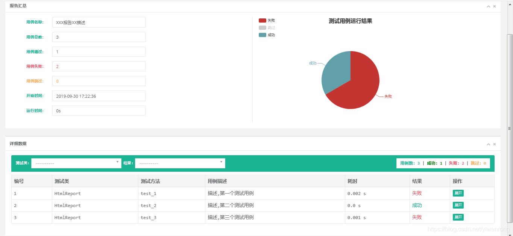

# 说明

- ```python+selenium+unittest```的测试代码
- ```run_test_case.py``` 读取test开头的py文件作为用例列表
- ```test0.py``` 本地执行用例
- ```test1.py``` 本地运行用例,多线程执行
- ```test2.py``` 本地使用用例，测试报告用```BeautifulReport```

- ```test3.py``` 本地运行用例，多线程运行，测试报告用```BeautifulReport```
- ```test4.py``` 远程调用服务器

